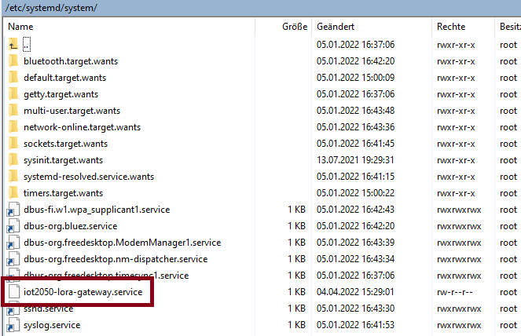

# **LoRa Gateway**

- [**LoRa Gateway**](#lora-gateway)
  - [**Overview**](#overview)
  - [**Software**](#software)
  - [**Hardware**](#hardware)
  - [**Installation and commissioning of the IOT2050 LoRaWAN Gateway**](#installation-and-commissioning-of-the-iot2050-lorawan-gateway)
    - [**Hardware installation**](#hardware-installation)
    - [**Prepare the IOT2050**](#prepare-the-iot2050)
    - [**Software installation and commissioning**](#software-installation-and-commissioning)
      - [**Setup the The Things Network Account as LoRa server**](#setup-the-the-things-network-account-as-lora-server)
      - [**Create gateway application**](#create-gateway-application)
    - [**Start the Application after Reboot**](#start-the-application-after-reboot)
    - [**Autostart of the LoRa-Gateway**](#autostart-of-the-lora-gateway)
  - [**Contribution and Contribution License Agreement**](#contribution-and-contribution-license-agreement)
  - [**Licence and Legal Information**](#licence-and-legal-information)

## **Overview**

The application shows how a gateway can be built using the LPWAN technology Long Range (LoRa) and the IOT2050. The global, free LoRaWAN (Long Range Wide Area Network) from The Things Network or The Things Stack Community Edition is used as the network server. This manual describes the software and hardware structure of the gateway.

This application describes the setup with the WM1302 LoRaWAN Gateway Module (USB) - EU868.

## **Software**

The following software is used for the application:

- PuTTY V0.75 to access the IOT2050
- optional: WINSCP V5.19.3 to copy prepared files to the IOT2050 (for autostart-function)

## **Hardware**

The following hardware components are required for the application:

- **SIMATIC IOT2050** as the LoRaWAN-Gateway
- **WM1302 LoRaWAN Gateway Module (USB) - EU868**
- **2 dBi Dipole Antenna 863-870MHz with RP SMA** (the selected antenna is based on the frequency range used in Europe from 863 to 870 MHz)
- **U.FL to reverse SMA adapter** as antenna cable

## **Installation and commissioning of the IOT2050 LoRaWAN Gateway**

The IOT2050 will be used as LoRaWAN gateway. As the IOT2050 does not include a LoRaWAN concentrator chip an additional LoRaWAN concentrator board is required. The seeed WM1302 mPCIe LoRaWAN concentrator board turned out to be perfectly suited for IOT2050. The installation and commissioning is very easy and straight forward.

### **Hardware installation**

To access the mPCIe connector, the housing of the IOT2050 must be opened: Open the two screws on the X30-COM connector. Then the housing can be opened via the two indentations.

In the next step the WM1302 board needs to be attached on the mPCIe slot of the IOT2050:

Afterwards the bulkhead cable and the antenna can be attached.

### **Prepare the IOT2050**

Follow [SIMATIC_IOT2050_Setting_up.md](https://github.com/SIMATICmeetsLinux/IOT2050-SmartFarming-Application/blob/main/docs/SIMATIC_IOT2050_setting_up.md) for the following steps:

- Installing the SD-Card Example Image (in this example the image V1.2.1 was used)
- First commissioning of the SIMATIC IOT2050: Remote access with Putty SSH Connection
- Working internet connection on the IOT2050

### **Software installation and commissioning**

#### **Setup the The Things Network Account as LoRa server**

After these steps the IOT2050 is ready for first boot. A The Things Network (TTN) account is required for the next steps. Simply go to [https://www.thethingsnetwork.org/](https://www.thethingsnetwork.org/) and create a free (community) account:

|Nr.|Action|
|-|-|
|1.|Press "Sign Up" in the upper right corner.|
|||
|2.|Press "Get Started" under Community -> Individual.|
|||
|3.|Select the "Europe 1"-Cluster.|
|||
|4.|Press "Register".|
|||
|5.|Fill in username, email address and password and click "Create Account".|
|||
|6.|Go to your email inbox and activate the account via the email you received..|
|||
|7.|The registration is now complete.|

#### **Create gateway application**

After the initial setup has been finished and a TTN account has been created the WM1302 board can be set up. Make sure that the IOT2050 has an internet connection to allow installing required software packages and to be able to establish a connection to the TTN server. Open a ssh connection using putty and simply follow the getting started documentation from seeed starting at [step 3 (get and compile sx1302 code)](https://wiki.seeedstudio.com/WM1302_module/#step3-get-and-compile-sx1302-source-code).

    NOTE: Make sure to use the global_conf.json.sx1250.EU868.USB file.

    Gateway EUI: The Gateway EUI is a 64 bit extended unique identifier for your end device. You can put together the 16-digit combination of the numbers 0-9 and the letters A-F by yourself.

After following the instructions in step 3 and step 4 the gateway should appear in your TTN account:

### **Start the Application after Reboot**

The application has no autostart function by default and must therefore be restarted manually after rebooting the IOT2050:

    cd ~
    cd sx1302_hal/
    cd packet_forwarder/
    ./lora_pkt_fwd -c global_conf.json.sx1250.EU868.USB

### **Autostart of the LoRa-Gateway**

The autostart of the gateway can be set up as follows: Use WINSCP to connect to the IOT2050. Go to the directory */root/sx1302_hal/packet_forwarder/*. Copy the ready-made shell script [start.sh](src/start.sh) into the directory:

The script must then be provided with executable rights:

    cd sx1302_hal/
    cd packet_forwarder/
    chmod 755 start.sh

Go to the directory */etc/systemd/system/*. Copy the ready-made shell script [iot2050-lora-gateway.service](src/iot2050-lora-gateway.service) into the directory:

The service file can now be started manually and tested with the following command:

    cd /etc/systemd/system/
    sudo systemctl start iot2050-lora-gateway.service

After successful start of the gateway (you can see if it's connected in The Things Network), it can be terminated with the following command:

    sudo systemctl stop iot2050-lora-gateway.service

To enable the autostart of the service use the command:

    sudo systemctl enable iot2050-lora-gateway.service

After the next reboot, the gateway will be started with every boot.

## **Contribution and Contribution License Agreement**

Thank you for your interest in contributing. Anybody is free to report bugs, unclear documentation, and other problems regarding this repository in the Issues section.
Additionally everybody is free to propose any changes to this repository using Pull Requests.

If you haven't previously signed the [Siemens Contributor License Agreement](https://cla-assistant.io/industrial-edge/) (CLA), the system will automatically prompt you to do so when you submit your Pull Request. This can be conveniently done through the CLA Assistant's online platform. Once the CLA is signed, your Pull Request will automatically be cleared and made ready for merging if all other test stages succeed.

## **Licence and Legal Information**

Please read the [Legal information](LICENSE.md).
